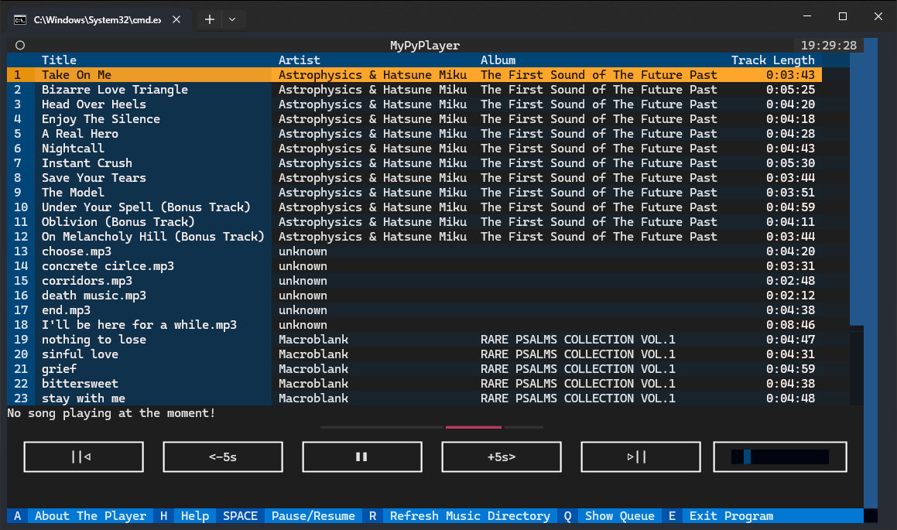

# MyPyPlayer

> Simple music player written in Python

## Features:

- GUI and TUI versions both use the same logic
- Play, skip, rewind, seek through tracks
- Queue System which can be saved to be played later
- Fancy buttons, tables sliders and progress bars
- Supports metadata from .mp3 files
- FROGS!

## Made with:

- Pygame
- eyed3
- PyYAML
- Textual (only in TUI version)
- Textual Slider (only in TUI version)
- tkinter.ttk (only in GUI version)
- CustomTkinter (only in GUI version)
- CTkMessagebox (only in GUI version)
- Pillow (only in GUI version)

## Screenshots

### Text-based user interface:





### Graphical user interface:


## Installation

At first download all the files from this repository. Then install it by:
```bash
pip install -r requirements.txt
```
**Note:** you need to have Python and pip installed to use this.

## Usage

MyPyPlayer will scan your Music directory, so be sure to move all your music there.

For text based user interface launch the player with:
```bash
python tui.py
```
For graphical user interface launch the player with:
```bash
python gui.py
```
Use your mouse and keyboard to navigate through player.

## Future plans:

 - [x] Tidy up the code
 - [x] Create GUI version with the same logic
 - [ ] Add playlist support
 - [ ] Add menu to choosing custom music directory

## Made by:
Piotr Radziszewski

MyPHPoL 2023
